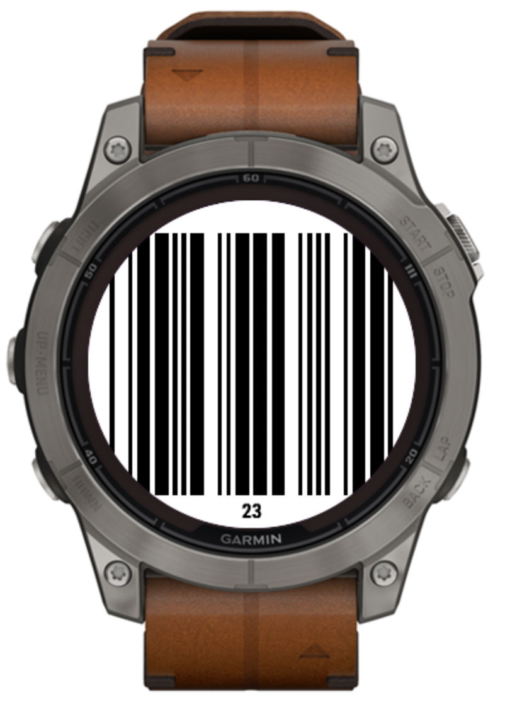

# GymCode

Display your gym membership barcode (Code 39 support only) on your Garmin watch.

<p align="center">
  
</p>

This application has been tested and verified to work on the **Fenix 7 Pro**. Change `target` to match your device in the Makefile (e.g., `vivoactive4`, `fenix6`)

## Widget

GymCode is a widget that appears in your watch's "at glance" menu. Press the down button on your watch face to access the menu and locate GymCode to display your barcode.

## Requirements

- [Connect IQ SDK](https://developer.garmin.com/connect-iq/sdk/) installed and `monkeyc` in your PATH

## Setup

1. Generate a developer key (first time only):

```bash
openssl genrsa 4096 | openssl pkcs8 -topk8 -nocrypt -outform DER -out developer_key
```

2. Edit `source/gymcodeview.mc` and set your membership ID:

```monkey-c
private const MEMBERSHIP_ID = "YOUR_ID_HERE";
```

3. Build the app:

```bash
make build target=fenix7pro
```

4. Transfer to watch:

Via MTP (requires libmtp)
- macOS: brew install libmtp
- Ubuntu/Debian: sudo apt install libmtp-1 libmtp-dev libmtp-bin

`make push`

Or manually copy bin/GymCode.prg to /GARMIN/Apps on your watch
